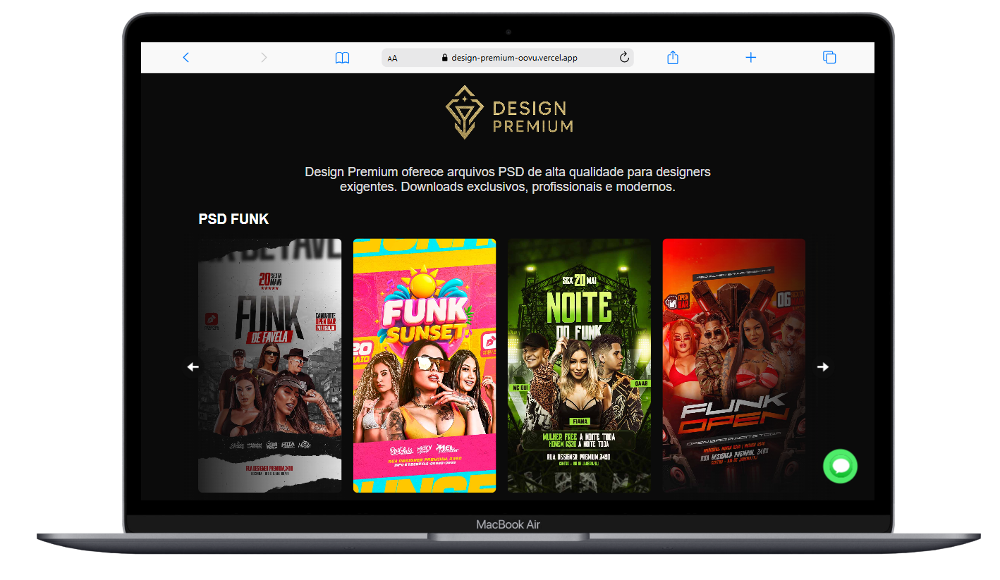
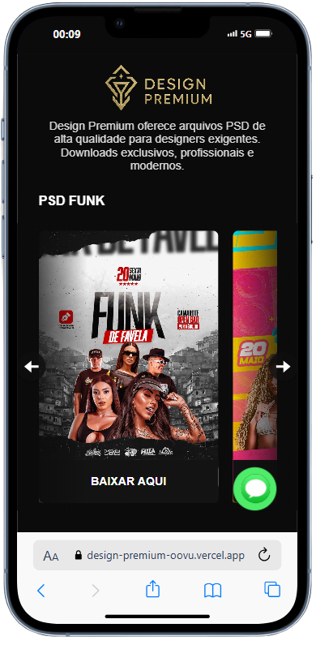

# 🎨 Design Premium PSD

Este projeto é um catálogo visual de arquivos PSD de alta qualidade organizados por categorias como Funk, Gospel, Sertanejo, entre outros. Desenvolvido com React e Styled Components, oferece uma experiência fluida de navegação horizontal em carrossel e contato rápido via WhatsApp.

---

## 🚀 Funcionalidades

- ✅ Interface responsiva e moderna.
- ✅ Carrossel horizontal para navegação por categorias de PSD.
- ✅ Pré-visualização de arquivos com botão de download.
- ✅ Contato rápido via WhatsApp com mensagem personalizada.
- ✅ Footer com link para o Instagram do autor.

---

## 🖼️ Prints do projeto

<div style="display: flex; justify-content: center; gap: 20px;">
  
  
</div>

## 📁 Estrutura de Componentes

### `App.jsx`

Componente principal que monta a estrutura da página. Renderiza:

- Logo
- Descrição
- Seções com carrosséis
- Componente de contato
- Rodapé

### `Carrossel.jsx`

Renderiza cada grupo de PSDs como um carrossel scrollável:

- Recebe `props.arquivos` e `props.title`.
- Permite scroll com botões de seta.

### `Contato.jsx`

Botão flutuante que abre uma conversa no WhatsApp com mensagem personalizada:

- O número e texto são passados por props.

### `Footer.jsx`

Rodapé simples com o ano atual e link para o Instagram do autor.

---

## 🖌️ Estilização

Utiliza `styled-components` com animações, responsividade e hover states refinados:

- `Container`: layout principal
- `CardContainer`: cards roláveis horizontalmente
- `Card`: visual dos arquivos com botão de download
- `ContatoContainer`: botão animado de contato
- `NavButton`: botões laterais para scroll

---

## 🧩 Listas de Arquivos

As listas de arquivos PSD são importadas via:

```js
import { ListaFunk, ListaGospel, ListaSertanejo, ListaPagode, ListaFestaJunina, ListaRock, ListaNamorados, ListaEletronica } from "./Arquivos/Index";
```

Cada item da lista deve conter:

```js
{
  id: string,
  genre: string,
  image: string,
  link: string
}
```

---

## 📦 Instalação

```bash
# Clonar repositório
git clone https://github.com/seu-usuario/design-premium-psd.git

# Acessar a pasta do projeto
cd design-premium-psd

# Instalar dependências
npm install

# Rodar o projeto
npm run dev
```

---

## 🛠️ Tecnologias Utilizadas

- React
- Styled-components
- Vite
- SVG e ícones personalizados

---

## 📞 Contato

Desenvolvido com 💚 por **Gabriel Vieira**  
[Instagram](https://instagram.com/eu.gabrielvieira)

---

---

## 🌐 Visualização Online

O projeto está disponível para visualização no seguinte link:

🔗 **[design-premium-oovu.vercel.app](https://design-premium-oovu.vercel.app/)**

---

## 🚀 Deploy com Vercel

O projeto foi publicado utilizando a plataforma [Vercel](https://vercel.com/).  
Para subir o projeto na Vercel, siga os passos:

1. Faça login ou crie uma conta em [vercel.com](https://vercel.com/).
2. Clique em **"Add New" → "Project"**.
3. Conecte seu repositório GitHub, GitLab ou Bitbucket.
4. Selecione o repositório do projeto.
5. A Vercel detectará automaticamente que se trata de um projeto **Vite + React**.
6. Basta clicar em **Deploy** e aguardar a publicação.

---

## ⚙️ Configuração do Vite

O projeto utiliza **Vite** para desenvolvimento front-end rápido. Abaixo está a configuração personalizada (`vite.config.js`):

```js
import { defineConfig } from "vite";
import react from "@vitejs/plugin-react";
import path from "path"; // <- ESSENCIAL!

// https://vite.dev/config/
export default defineConfig({
  plugins: [react()],
  server: {
    port: 3000,
    open: true,
  },
  resolve: {
    alias: {
      "@": path.resolve(__dirname, "./src"),
    },
  },
});
```

**Configurações explicadas:**

- `port: 3000`: O servidor local roda na porta 3000.
- `open: true`: O navegador abre automaticamente ao rodar o projeto.
- `alias @`: Facilita a importação de arquivos dentro da pasta `src`, como `@/components/Carrossel`.

---
